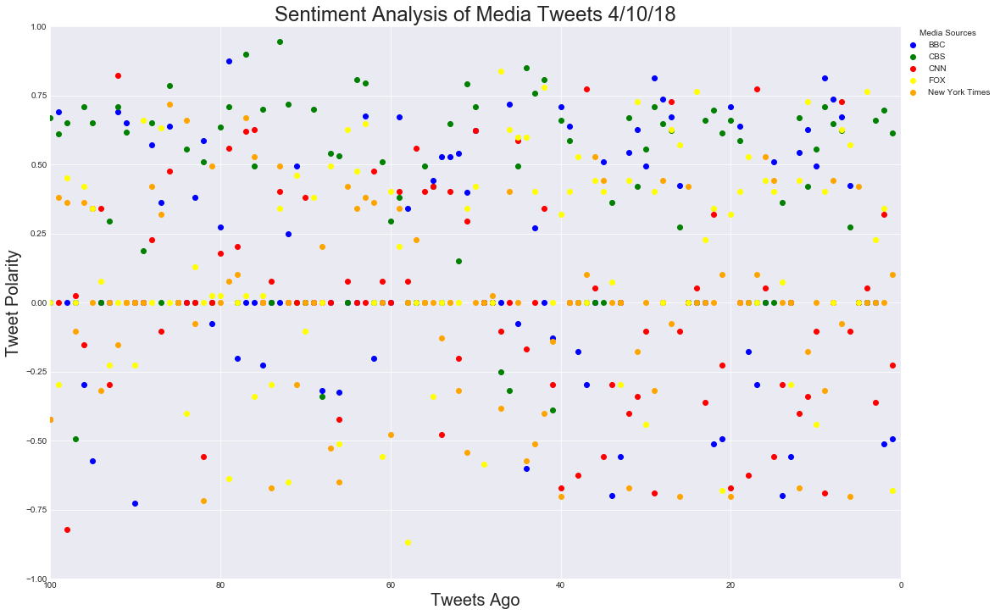
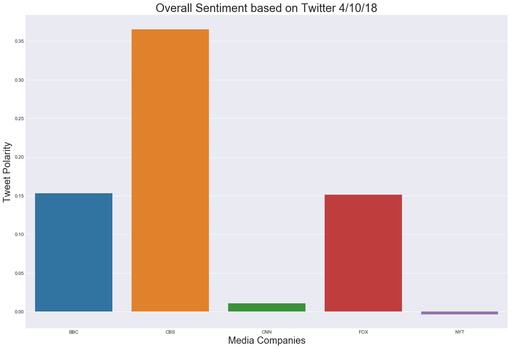

<H1>News Mood</H1>
<H3>Arjun Maniyar</H3>


In this assignment, you'll create a Python script to perform a sentiment analysis of the Twitter activity of various news oulets, and to present your findings visually.

Your final output should provide a visualized summary of the sentiments expressed in Tweets sent out by the following news organizations: __BBC, CBS, CNN, Fox, and New York times__.


The first plot will be and/or feature the following:

* Be a scatter plot of sentiments of the last __100__ tweets sent out by each news organization, ranging from -1.0 to 1.0, where a score of 0 expresses a neutral sentiment, -1 the most negative sentiment possible, and +1 the most positive sentiment possible.
* Each plot point will reflect the _compound_ sentiment of a tweet.
* Sort each plot point by its relative timestamp.

The second plot will be a bar plot visualizing the _overall_ sentiments of the last 100 tweets from each organization. For this plot, you will again aggregate the compound sentiments analyzed by VADER.

The tools of the trade you will need for your task as a data analyst include the following: tweepy, pandas, matplotlib, seaborn, textblob, and VADER.

Your final Jupyter notebook must:

* Pull last 100 tweets from each outlet.
* Perform a sentiment analysis with the compound, positive, neutral, and negative scoring for each tweet.
* Pull into a DataFrame the tweet's source acount, its text, its date, and its compound, positive, neutral, and negative sentiment scores.
* Export the data in the DataFrame into a CSV file.
* Save PNG images for each plot.


```python
import tweepy
import matplotlib.pyplot as plt
import pandas as pd
import numpy as np
import seaborn as sns


# Import and Initialize Sentiment Analyzer
from vaderSentiment.vaderSentiment import SentimentIntensityAnalyzer
analyzer = SentimentIntensityAnalyzer()

# Twitter API Keys
from config import (consumer_key, 
                    consumer_secret, 
                    access_token, 
                    access_token_secret)

# Setup Tweepy API Authentication
auth = tweepy.OAuthHandler(consumer_key, consumer_secret)
auth.set_access_token(access_token, access_token_secret)
api = tweepy.API(auth, parser=tweepy.parsers.JSONParser())
```


```python
# Target News Companies
target_users = ("@BBC", "@CBS", "@CNN","@FoxNews", "@nytimes")
```


```python
# Create empty lists of all of the variables to hold the data.
bbc_tweets = []
bbc_name = []
bbc_tweets_date = []
bbc_tweet_count = []

cbs_tweets = []
cbs_name = []
cbs_tweets_date = []
cbs_tweet_count = []

cnn_tweets = []
cnn_name = []
cnn_tweets_date = []
cnn_tweet_count = []

fox_tweets = []
fox_name = []
fox_tweets_date = []
fox_tweet_count = []

nyt_tweets = []
nyt_name = []
nyt_tweets_date = []
nyt_tweet_count = []


```


```python
# Loop through target users
for target_user in target_users:
    
    # Loop through the twitter pages
    for x in range(5):
        public_tweets = api.user_timeline(target_user, page=x)
        
        # Append tweet to correct list
        for tweet in range(20):
            if target_user == "@BBC":
                news_tweet = public_tweets[tweet]['text']
                bbc_tweets.append(news_tweet)
                news_tweet_date = public_tweets[tweet]['created_at']
                bbc_tweets_date.append(news_tweet_date)
                news_name = public_tweets[tweet]['user']['name']
                bbc_name.append(news_name)
                bbc_tweet_num = len(bbc_tweets)
                bbc_tweet_count.append(bbc_tweet_num)
                
            elif target_user == "@CBS":
                news_tweet = public_tweets[tweet]['text']
                cbs_tweets.append(news_tweet)
                news_tweet_date = public_tweets[tweet]['created_at']
                cbs_tweets_date.append(news_tweet_date)
                news_name = public_tweets[tweet]['user']['name']
                cbs_name.append(news_name)
                cbs_tweet_num = len(cbs_tweets)
                cbs_tweet_count.append(cbs_tweet_num)
                
            elif target_user == "@CNN":
                news_tweet = public_tweets[tweet]['text']
                cnn_tweets.append(news_tweet)
                news_tweet_date = public_tweets[tweet]['created_at']
                cnn_tweets_date.append(news_tweet_date)
                news_name = public_tweets[tweet]['user']['name']
                cnn_name.append(news_name)
                cnn_tweet_num = len(cnn_tweets)
                cnn_tweet_count.append(cnn_tweet_num)
                
            elif target_user == "@FoxNews":
                news_tweet = public_tweets[tweet]['text']
                fox_tweets.append(news_tweet)
                news_tweet_date = public_tweets[tweet]['created_at']
                fox_tweets_date.append(news_tweet_date)
                news_name = public_tweets[tweet]['user']['name']
                fox_name.append(news_name)
                fox_tweet_num = len(fox_tweets)
                fox_tweet_count.append(fox_tweet_num)
                
            elif target_user == "@nytimes":
                news_tweet = public_tweets[tweet]['text']
                nyt_tweets.append(news_tweet)
                news_tweet_date = public_tweets[tweet]['created_at']
                nyt_tweets_date.append(news_tweet_date)
                news_name = public_tweets[tweet]['user']['name']
                nyt_name.append(news_name)
                nyt_tweet_num = len(nyt_tweets)
                nyt_tweet_count.append(nyt_tweet_num)
```


```python
# List a list to hold all of the tweets
total_tweets = [bbc_tweets, cbs_tweets, cnn_tweets, fox_tweets, nyt_tweets]

# Variables for Companies' sentiments
bbc_comp_list = []
bbc_pos_list = []
bbc_neg_list = []
bbc_neu_list = []

cbs_comp_list = []
cbs_pos_list = []
cbs_neg_list = []
cbs_neu_list = []

cnn_comp_list = []
cnn_pos_list = []
cnn_neg_list = []
cnn_neu_list = []

fox_comp_list = []
fox_pos_list = []
fox_neg_list = []
fox_neu_list = []

nyt_comp_list = []
nyt_pos_list = []
nyt_neg_list = []
nyt_neu_list = []
```


```python
for company in total_tweets:
    
    if company == bbc_tweets:
        for score in range(100):
            results = analyzer.polarity_scores(company[score])
            bbc_comp = results["compound"]
            bbc_pos = results["pos"]
            bbc_neu = results["neu"]
            bbc_neg = results["neg"]
            bbc_comp_list.append(bbc_comp)
            bbc_pos_list.append(bbc_pos)
            bbc_neg_list.append(bbc_neg)
            bbc_neu_list.append(bbc_neu)
    
    elif company == cbs_tweets:
        for score in range(100):
            results = analyzer.polarity_scores(company[score])
            cbs_comp = results["compound"]
            cbs_pos = results["pos"]
            cbs_neu = results["neu"]
            cbs_neg = results["neg"]
            cbs_comp_list.append(cbs_comp)
            cbs_pos_list.append(cbs_pos)
            cbs_neg_list.append(cbs_neg)
            cbs_neu_list.append(cbs_neu)
            
    elif company == cnn_tweets:
        for score in range(100):
            results = analyzer.polarity_scores(company[score])
            cnn_comp = results["compound"]
            cnn_pos = results["pos"]
            cnn_neu = results["neu"]
            cnn_neg = results["neg"]
            cnn_comp_list.append(cnn_comp)
            cnn_pos_list.append(cnn_pos)
            cnn_neg_list.append(cnn_neg)
            cnn_neu_list.append(cnn_neu)
            
    elif company == fox_tweets:
        for score in range(100):
            results = analyzer.polarity_scores(company[score])
            fox_comp = results["compound"]
            fox_pos = results["pos"]
            fox_neu = results["neu"]
            fox_neg = results["neg"]
            fox_comp_list.append(fox_comp)
            fox_pos_list.append(fox_pos)
            fox_neg_list.append(fox_neg)
            fox_neu_list.append(fox_neu)
            
    elif company == nyt_tweets:
        for score in range(100):
            results = analyzer.polarity_scores(company[score])
            nyt_comp = results["compound"]
            nyt_pos = results["pos"]
            nyt_neu = results["neu"]
            nyt_neg = results["neg"]
            nyt_comp_list.append(nyt_comp)
            nyt_pos_list.append(nyt_pos)
            nyt_neg_list.append(nyt_neg)
            nyt_neu_list.append(nyt_neu)
```


```python
# Formatting DataFrames
# BBC

bbc_tweets_df = pd.DataFrame(bbc_tweets)
# renaming the column
new_bbc_tweets_df = bbc_tweets_df.rename(columns={0 : 'Tweets'})

bbc_name_df = pd.DataFrame(bbc_name)
new_bbc_name_df = bbc_name_df.rename(columns={0 : 'Name'})

bbc_tweets_date_df = pd.DataFrame(bbc_tweets_date)
new_bbc_tweets_date_df = bbc_tweets_date_df.rename(columns={0 : 'Date'})

bbc_comp_list_df = pd.DataFrame(bbc_comp_list)
new_bbc_comp_list_df = bbc_comp_list_df.rename(columns={0 : 'Compound Score'})

bbc_pos_list_df = pd.DataFrame(bbc_pos_list)
new_bbc_pos_list_df = bbc_pos_list_df.rename(columns={0 : 'Positive Score'})

bbc_neg_list_df = pd.DataFrame(bbc_neg_list) 
new_bbc_neg_list_df = bbc_neg_list_df.rename(columns={0 : 'Negative Score'})

bbc_neu_list_df = pd.DataFrame(bbc_neu_list)
new_bbc_neu_list_df = bbc_neu_list_df.rename(columns={0 : 'Neutral Score'})

bbc_tweet_count_df = pd.DataFrame(bbc_tweet_count)
new_bbc_tweet_count_df = bbc_tweet_count_df.rename(columns={0 : 'Tweet Count'})

# Creating CBS DF

cbs_tweets_df = pd.DataFrame(cbs_tweets)
new_cbs_tweets_df= cbs_tweets_df.rename(columns={0 : 'Tweets'})

cbs_name_df = pd.DataFrame(cbs_name)
new_cbs_name_df = cbs_name_df.rename(columns={0: 'Name'})

cbs_tweets_date_df = pd.DataFrame(cbs_tweets_date)
new_cbs_tweets_date_df = cbs_tweets_date_df.rename(columns={0: 'Date'})

cbs_comp_list_df = pd.DataFrame(cbs_comp_list)
new_cbs_comp_list_df = cbs_comp_list_df.rename(columns={0: 'Compound Score'})

cbs_pos_list_df = pd.DataFrame(cbs_pos_list)
new_cbs_pos_list_df = cbs_pos_list_df.rename(columns={0: 'Postive Score'})

cbs_neg_list_df = pd.DataFrame(cbs_neg_list)
new_cbs_neg_list_df = cbs_neg_list_df.rename(columns={0: 'Negative Score'})

cbs_neu_list_df = pd.DataFrame(cbs_neu_list)
new_cbs_neu_list_df = cbs_neu_list_df.rename(columns={0: 'Neutral Score'})

cbs_tweet_count_df = pd.DataFrame(cbs_tweet_count)
new_cbs_tweet_count_df = cbs_tweet_count_df.rename(columns={0: 'Tweet Count'})

# CNN DF

cnn_tweets_df = pd.DataFrame(cnn_tweets)
new_cnn_tweets_df = cnn_tweets_df.rename(columns={0 : 'Tweets'})

cnn_name_df = pd.DataFrame(cnn_name)
new_cnn_name_df = cnn_name_df.rename(columns={0: 'Name'})

cnn_tweets_date_df = pd.DataFrame(cnn_tweets_date)
new_cnn_tweets_date_df = cnn_tweets_date_df.rename(columns={0: 'Date'})

cnn_comp_list_df = pd.DataFrame(cnn_comp_list)
new_cnn_comp_list_df = cnn_comp_list_df.rename(columns={0: 'Compound Score'})

cnn_pos_list_df = pd.DataFrame(cnn_pos_list)
new_cnn_pos_list_df = cnn_pos_list_df.rename(columns={0: 'Postive Score'})

cnn_neg_list_df = pd.DataFrame(cnn_neg_list)
new_cnn_neg_list_df = cnn_neg_list_df.rename(columns={0: 'Negative Score'})

cnn_neu_list_df = pd.DataFrame(cnn_neu_list)
new_cnn_neu_list_df = cnn_neu_list_df.rename(columns={0: 'Neutral Score'})

cnn_tweet_count_df = pd.DataFrame(cnn_tweet_count)
new_cnn_tweet_count_df = cnn_tweet_count_df.rename(columns={0: 'Tweet Count'})

# Fox DF

fox_tweets_df = pd.DataFrame(fox_tweets)
new_fox_tweets_df= fox_tweets_df.rename(columns={0 : 'Tweets'})

fox_name_df = pd.DataFrame(fox_name)
new_fox_name_df = fox_name_df.rename(columns={0: 'Name'})

fox_tweets_date_df = pd.DataFrame(fox_tweets_date)
new_fox_tweets_date_df = fox_tweets_date_df.rename(columns={0: 'Date'})

fox_comp_list_df = pd.DataFrame(fox_comp_list)
new_fox_comp_list_df = fox_comp_list_df.rename(columns={0: 'Compound Score'})

fox_pos_list_df = pd.DataFrame(fox_pos_list)
new_fox_pos_list_df = fox_pos_list_df.rename(columns={0: 'Postive Score'})

fox_neg_list_df = pd.DataFrame(fox_neg_list)
new_fox_neg_list_df = fox_neg_list_df.rename(columns={0: 'Negative Score'})

fox_neu_list_df = pd.DataFrame(fox_neu_list)
new_fox_neu_list_df = fox_neu_list_df.rename(columns={0: 'Neutral Score'})

fox_tweet_count_df = pd.DataFrame(fox_tweet_count)
new_fox_tweet_count_df = fox_tweet_count_df.rename(columns={0: 'Tweet Count'})

# NYT DF

nyt_tweets_df = pd.DataFrame(nyt_tweets)
new_nyt_tweets_df = nyt_tweets_df.rename(columns={0 : 'Tweets'})

nyt_name_df = pd.DataFrame(nyt_name)
new_nyt_name_df = nyt_name_df.rename(columns={0: 'Name'})

nyt_tweets_date_df = pd.DataFrame(nyt_tweets_date)
new_nyt_tweets_date_df = nyt_tweets_date_df.rename(columns={0: 'Date'})

nyt_comp_list_df = pd.DataFrame(nyt_comp_list)
new_nyt_comp_list_df = nyt_comp_list_df.rename(columns={0: 'Compound Score'})

nyt_pos_list_df = pd.DataFrame(nyt_pos_list)
new_nyt_pos_list_df = nyt_pos_list_df.rename(columns={0: 'Postive Score'})

nyt_neg_list_df = pd.DataFrame(nyt_neg_list)
new_nyt_neg_list_df = nyt_neg_list_df.rename(columns={0: 'Negative Score'})

nyt_neu_list_df = pd.DataFrame(cbs_neu_list)
new_nyt_neu_list_df = nyt_neu_list_df.rename(columns={0: 'Neutral Score'})

nyt_tweet_count_df = pd.DataFrame(nyt_tweet_count)
new_nyt_tweet_count_df = nyt_tweet_count_df.rename(columns={0: 'Tweet Count'})

                                                       
```


```python
# Joining the DF's together

bbc_1 = new_bbc_tweets_df.join(new_bbc_name_df)
bbc_2 = bbc_1.join(new_bbc_tweets_date_df)
bbc_3 = bbc_2.join(new_bbc_comp_list_df)
bbc_4 = bbc_3.join(new_bbc_pos_list_df)
bbc_5 = bbc_4.join(new_bbc_neg_list_df)
bbc_6 = bbc_5.join(new_bbc_neu_list_df)
bbc_final = bbc_6.join(new_bbc_tweet_count_df)
bbc_final.head()
```


<div>
<style scoped>
    .dataframe tbody tr th:only-of-type {
        vertical-align: middle;
    }

    .dataframe tbody tr th {
        vertical-align: top;
    }

    .dataframe thead th {
        text-align: right;
    }
</style>
<table border="1" class="dataframe">
  <thead>
    <tr style="text-align: right;">
      <th></th>
      <th>Tweets</th>
      <th>Name</th>
      <th>Date</th>
      <th>Compound Score</th>
      <th>Positive Score</th>
      <th>Negative Score</th>
      <th>Neutral Score</th>
      <th>Tweet Count</th>
    </tr>
  </thead>
  <tbody>
    <tr>
      <th>0</th>
      <td>It wasn't until Henry VIII's reign that the #T...</td>
      <td>BBC</td>
      <td>Tue Apr 10 18:42:00 +0000 2018</td>
      <td>-0.4927</td>
      <td>0.0</td>
      <td>0.158</td>
      <td>0.842</td>
      <td>1</td>
    </tr>
    <tr>
      <th>1</th>
      <td>Meet Rebekah - a former professional footballe...</td>
      <td>BBC</td>
      <td>Tue Apr 10 18:00:27 +0000 2018</td>
      <td>-0.5106</td>
      <td>0.0</td>
      <td>0.216</td>
      <td>0.784</td>
      <td>2</td>
    </tr>
    <tr>
      <th>2</th>
      <td>🌶🤯 A man who ate the world's hottest chilli pe...</td>
      <td>BBC</td>
      <td>Tue Apr 10 16:58:05 +0000 2018</td>
      <td>0.0000</td>
      <td>0.0</td>
      <td>0.000</td>
      <td>1.000</td>
      <td>3</td>
    </tr>
    <tr>
      <th>3</th>
      <td>RT @bbccomedy: Henry of Eight, the Tudor Kim K...</td>
      <td>BBC</td>
      <td>Tue Apr 10 16:34:54 +0000 2018</td>
      <td>0.0000</td>
      <td>0.0</td>
      <td>0.000</td>
      <td>1.000</td>
      <td>4</td>
    </tr>
    <tr>
      <th>4</th>
      <td>👭 Ten celebrity pairs who look so freakily ali...</td>
      <td>BBC</td>
      <td>Tue Apr 10 16:32:08 +0000 2018</td>
      <td>0.0000</td>
      <td>0.0</td>
      <td>0.000</td>
      <td>1.000</td>
      <td>5</td>
    </tr>
  </tbody>
</table>
</div>


```python
cbs_1 = new_cbs_tweets_df.join(new_cbs_name_df)
cbs_2 = cbs_1.join(new_cbs_tweets_date_df)
cbs_3 = cbs_2.join(new_cbs_comp_list_df)
cbs_4 = cbs_3.join(new_cbs_pos_list_df)
cbs_5 = cbs_4.join(new_cbs_neg_list_df)
cbs_6 = cbs_5.join(new_cbs_neu_list_df)
cbs_final = cbs_6.join(new_cbs_tweet_count_df)
cbs_final.head()
```


<div>
<style scoped>
    .dataframe tbody tr th:only-of-type {
        vertical-align: middle;
    }

    .dataframe tbody tr th {
        vertical-align: top;
    }

    .dataframe thead th {
        text-align: right;
    }
</style>
<table border="1" class="dataframe">
  <thead>
    <tr style="text-align: right;">
      <th></th>
      <th>Tweets</th>
      <th>Name</th>
      <th>Date</th>
      <th>Compound Score</th>
      <th>Postive Score</th>
      <th>Negative Score</th>
      <th>Neutral Score</th>
      <th>Tweet Count</th>
    </tr>
  </thead>
  <tbody>
    <tr>
      <th>0</th>
      <td>Today's biggest artists including @littlebigto...</td>
      <td>CBS</td>
      <td>Tue Apr 10 19:00:03 +0000 2018</td>
      <td>0.6124</td>
      <td>0.248</td>
      <td>0.064</td>
      <td>0.688</td>
      <td>1</td>
    </tr>
    <tr>
      <th>1</th>
      <td>The legendary @eltonofficial said "It's the mo...</td>
      <td>CBS</td>
      <td>Tue Apr 10 15:30:00 +0000 2018</td>
      <td>0.6976</td>
      <td>0.253</td>
      <td>0.000</td>
      <td>0.747</td>
      <td>2</td>
    </tr>
    <tr>
      <th>2</th>
      <td>Are you ready for a good time? Tomorrow, Elton...</td>
      <td>CBS</td>
      <td>Mon Apr 09 20:00:00 +0000 2018</td>
      <td>0.6597</td>
      <td>0.221</td>
      <td>0.000</td>
      <td>0.779</td>
      <td>3</td>
    </tr>
    <tr>
      <th>3</th>
      <td>@edsheeran, @KeshaRose, @HaileeSteinfeld, @Act...</td>
      <td>CBS</td>
      <td>Mon Apr 09 17:29:47 +0000 2018</td>
      <td>0.0000</td>
      <td>0.000</td>
      <td>0.000</td>
      <td>1.000</td>
      <td>4</td>
    </tr>
    <tr>
      <th>4</th>
      <td>Lights will come on for @Jason_Aldean when he ...</td>
      <td>CBS</td>
      <td>Mon Apr 09 17:00:02 +0000 2018</td>
      <td>0.0000</td>
      <td>0.000</td>
      <td>0.000</td>
      <td>1.000</td>
      <td>5</td>
    </tr>
  </tbody>
</table>
</div>


```python
cnn_1 = new_cnn_tweets_df.join(new_cnn_name_df)
cnn_2 = cnn_1.join(new_cnn_tweets_date_df)
cnn_3 = cnn_2.join(new_cnn_comp_list_df)
cnn_4 = cnn_3.join(new_cnn_pos_list_df)
cnn_5 = cnn_4.join(new_cnn_neg_list_df)
cnn_6 = cnn_5.join(new_cnn_neu_list_df)
cnn_final = cnn_6.join(new_cnn_tweet_count_df)
cnn_final.head()
```


<div>
<style scoped>
    .dataframe tbody tr th:only-of-type {
        vertical-align: middle;
    }

    .dataframe tbody tr th {
        vertical-align: top;
    }

    .dataframe thead th {
        text-align: right;
    }
</style>
<table border="1" class="dataframe">
  <thead>
    <tr style="text-align: right;">
      <th></th>
      <th>Tweets</th>
      <th>Name</th>
      <th>Date</th>
      <th>Compound Score</th>
      <th>Postive Score</th>
      <th>Negative Score</th>
      <th>Neutral Score</th>
      <th>Tweet Count</th>
    </tr>
  </thead>
  <tbody>
    <tr>
      <th>0</th>
      <td>A lawsuit against Harvard on behalf of Asian-A...</td>
      <td>CNN</td>
      <td>Tue Apr 10 21:36:43 +0000 2018</td>
      <td>-0.2263</td>
      <td>0.000</td>
      <td>0.106</td>
      <td>0.894</td>
      <td>1</td>
    </tr>
    <tr>
      <th>1</th>
      <td>America made a promise in 1968. It's time to k...</td>
      <td>CNN</td>
      <td>Tue Apr 10 21:29:19 +0000 2018</td>
      <td>0.3182</td>
      <td>0.119</td>
      <td>0.000</td>
      <td>0.881</td>
      <td>2</td>
    </tr>
    <tr>
      <th>2</th>
      <td>As US President Donald Trump promised to respo...</td>
      <td>CNN</td>
      <td>Tue Apr 10 21:25:25 +0000 2018</td>
      <td>-0.3612</td>
      <td>0.106</td>
      <td>0.213</td>
      <td>0.681</td>
      <td>3</td>
    </tr>
    <tr>
      <th>3</th>
      <td>Chinese investment in the United States plumme...</td>
      <td>CNN</td>
      <td>Tue Apr 10 21:21:20 +0000 2018</td>
      <td>0.0516</td>
      <td>0.120</td>
      <td>0.111</td>
      <td>0.769</td>
      <td>4</td>
    </tr>
    <tr>
      <th>4</th>
      <td>A federal court has ruled that employers canno...</td>
      <td>CNN</td>
      <td>Tue Apr 10 21:18:49 +0000 2018</td>
      <td>0.0000</td>
      <td>0.000</td>
      <td>0.000</td>
      <td>1.000</td>
      <td>5</td>
    </tr>
  </tbody>
</table>
</div>


```python
fox_1 = new_fox_tweets_df.join(new_fox_name_df)
fox_2 = fox_1.join(new_fox_tweets_date_df)
fox_3 = fox_2.join(new_fox_comp_list_df)
fox_4 = fox_3.join(new_fox_pos_list_df)
fox_5 = fox_4.join(new_fox_neg_list_df)
fox_6 = fox_5.join(new_fox_neu_list_df)
fox_final = fox_6.join(new_fox_tweet_count_df)
fox_final.head()
```


<div>
<style scoped>
    .dataframe tbody tr th:only-of-type {
        vertical-align: middle;
    }

    .dataframe tbody tr th {
        vertical-align: top;
    }

    .dataframe thead th {
        text-align: right;
    }
</style>
<table border="1" class="dataframe">
  <thead>
    <tr style="text-align: right;">
      <th></th>
      <th>Tweets</th>
      <th>Name</th>
      <th>Date</th>
      <th>Compound Score</th>
      <th>Postive Score</th>
      <th>Negative Score</th>
      <th>Neutral Score</th>
      <th>Tweet Count</th>
    </tr>
  </thead>
  <tbody>
    <tr>
      <th>0</th>
      <td>.@BenSasse: “As a dad, do you worry about soci...</td>
      <td>Fox News</td>
      <td>Tue Apr 10 21:37:55 +0000 2018</td>
      <td>-0.6808</td>
      <td>0.000</td>
      <td>0.286</td>
      <td>0.714</td>
      <td>1</td>
    </tr>
    <tr>
      <th>1</th>
      <td>.@BenSasse: “I wouldn’t want you to leave here...</td>
      <td>Fox News</td>
      <td>Tue Apr 10 21:28:49 +0000 2018</td>
      <td>0.3415</td>
      <td>0.158</td>
      <td>0.053</td>
      <td>0.789</td>
      <td>2</td>
    </tr>
    <tr>
      <th>2</th>
      <td>.@ChrisCoons: “At the end of the day, policies...</td>
      <td>Fox News</td>
      <td>Tue Apr 10 21:24:25 +0000 2018</td>
      <td>0.2263</td>
      <td>0.091</td>
      <td>0.000</td>
      <td>0.909</td>
      <td>3</td>
    </tr>
    <tr>
      <th>3</th>
      <td>.@SenMikeLee: “Isn’t there a significant free ...</td>
      <td>Fox News</td>
      <td>Tue Apr 10 21:08:54 +0000 2018</td>
      <td>0.7650</td>
      <td>0.369</td>
      <td>0.000</td>
      <td>0.631</td>
      <td>4</td>
    </tr>
    <tr>
      <th>4</th>
      <td>Mark Zuckerberg: “What we’re going to do is re...</td>
      <td>Fox News</td>
      <td>Tue Apr 10 21:01:39 +0000 2018</td>
      <td>0.0000</td>
      <td>0.000</td>
      <td>0.000</td>
      <td>1.000</td>
      <td>5</td>
    </tr>
  </tbody>
</table>
</div>


```python
nyt_1 = new_nyt_tweets_df.join(new_nyt_name_df)
nyt_2 = nyt_1.join(new_nyt_tweets_date_df)
nyt_3 = nyt_2.join(new_nyt_comp_list_df)
nyt_4 = nyt_3.join(new_nyt_pos_list_df)
nyt_5 = nyt_4.join(new_nyt_neg_list_df)
nyt_6 = nyt_5.join(new_nyt_neu_list_df)
nyt_final = nyt_6.join(new_nyt_tweet_count_df)
nyt_final.head()
```


<div>
<style scoped>
    .dataframe tbody tr th:only-of-type {
        vertical-align: middle;
    }

    .dataframe tbody tr th {
        vertical-align: top;
    }

    .dataframe thead th {
        text-align: right;
    }
</style>
<table border="1" class="dataframe">
  <thead>
    <tr style="text-align: right;">
      <th></th>
      <th>Tweets</th>
      <th>Name</th>
      <th>Date</th>
      <th>Compound Score</th>
      <th>Postive Score</th>
      <th>Negative Score</th>
      <th>Neutral Score</th>
      <th>Tweet Count</th>
    </tr>
  </thead>
  <tbody>
    <tr>
      <th>0</th>
      <td>The Metropolitan Museum of Art has reached bey...</td>
      <td>The New York Times</td>
      <td>Tue Apr 10 21:32:04 +0000 2018</td>
      <td>0.1027</td>
      <td>0.065</td>
      <td>0.000</td>
      <td>0.688</td>
      <td>1</td>
    </tr>
    <tr>
      <th>1</th>
      <td>RT @kevinroose: Senator Coons asks a good q: w...</td>
      <td>The New York Times</td>
      <td>Tue Apr 10 21:17:04 +0000 2018</td>
      <td>0.0000</td>
      <td>0.127</td>
      <td>0.127</td>
      <td>0.747</td>
      <td>2</td>
    </tr>
    <tr>
      <th>2</th>
      <td>If you’re concerned about "Westworld" spoilers...</td>
      <td>The New York Times</td>
      <td>Tue Apr 10 21:08:06 +0000 2018</td>
      <td>0.0000</td>
      <td>0.000</td>
      <td>0.000</td>
      <td>0.779</td>
      <td>3</td>
    </tr>
    <tr>
      <th>3</th>
      <td>“No. I would probably not choose to do that pu...</td>
      <td>The New York Times</td>
      <td>Tue Apr 10 20:53:50 +0000 2018</td>
      <td>0.0000</td>
      <td>0.000</td>
      <td>0.000</td>
      <td>1.000</td>
      <td>4</td>
    </tr>
    <tr>
      <th>4</th>
      <td>Overwhelmed by the number of Netflix original ...</td>
      <td>The New York Times</td>
      <td>Tue Apr 10 20:50:09 +0000 2018</td>
      <td>0.4215</td>
      <td>0.324</td>
      <td>0.000</td>
      <td>1.000</td>
      <td>5</td>
    </tr>
  </tbody>
</table>
</div>


```python
bbc_final.to_csv('bbc_final.csv')
cbs_final.to_csv('cbs_final.csv')
cnn_final.to_csv('cnn_final.csv')
fox_final.to_csv('fox_final.csv')
nyt_final.to_csv('nyt_final.csv')
```


```python
# X and Y coordinates
x_bbc = bbc_final['Tweet Count']
y_bbc = bbc_final['Compound Score']

x_cbs = bbc_final['Tweet Count']
y_cbs = cbs_final['Compound Score']

x_cnn = cnn_final['Tweet Count']
y_cnn = cnn_final['Compound Score']

x_fox = fox_final['Tweet Count']
y_fox = fox_final['Compound Score']

x_nyt = nyt_final['Tweet Count']
y_nyt = nyt_final['Compound Score']
```


```python
# Implementing scatter plot
fig, ax = plt.subplots(figsize = (18,12))

plt.scatter(x=x_bbc, y=y_bbc, c='blue', label= 'BBC')
plt.scatter(x=x_cbs, y=y_cbs, c='green', label= 'CBS')
plt.scatter(x=x_cnn, y=y_cnn, c='red', label= 'CNN')
plt.scatter(x=x_fox, y=y_fox, c='yellow', label= 'FOX')
plt.scatter(x=x_nyt, y=y_nyt, c='orange', label= 'New York Times')
plt.xlim(100, 0)
plt.ylim(-1, 1)
plt.xlabel('Tweets Ago', size= "20")
plt.ylabel('Tweet Polarity', size = "20")
# now = datetime.now()
# now = now.strftime("%Y-%m-%d %H:%M")
plt.title('Sentiment Analysis of Media Tweets 4/10/18', size = "24")
plt.legend(title='Media Sources', bbox_to_anchor=(1, 1), loc=2, borderaxespad=0)
plt.savefig(f'Sentiment Analysis of Media Tweets')


```





```python
# Bar Chart
handles = ["BBC", "CBS", "CNN", "FOX", "NYT"]
overall_sentiment_bbc = bbc_final['Compound Score'].mean()
overall_sentiment_cbs = cbs_final['Compound Score'].mean()
overall_sentiment_cnn = cnn_final['Compound Score'].mean()
overall_sentiment_fox = fox_final['Compound Score'].mean()
overall_sentiment_nyt = nyt_final['Compound Score'].mean()

y_axis = [overall_sentiment_bbc, overall_sentiment_cbs, overall_sentiment_cnn,
          overall_sentiment_fox, overall_sentiment_nyt]
```


```python
fig, ax = plt.subplots(figsize = (18,12))
sns.barplot(x=handles, y=y_axis)
plt.xlabel('Media Companies', size = "20")
plt.ylabel('Tweet Polarity', size = "20")
plt.title('Overall Sentiment based on Twitter 4/10/18', size = "24")
plt.savefig(f'Overall Sentiment based on Twitter')
```




